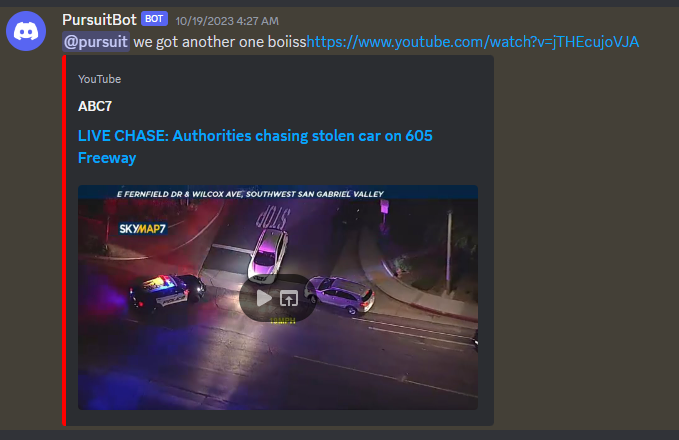

# What it does
This is a script i wrote so i can get notifications if certain channels go live on youtube, it check their live videos to a list of keywords and if it contains said keyword it posts a link to the video to a discord webhook. it automaticly calculates the time between polls to avoid getting rate limited. however the youtube api is very restrictive on quota's and at most you can poll every 15 minutes if you only check 1 channel



**the script currently comes with 2 versions:**   
- the lite version, wich just contains the script to check for livestreams and posts them to discord aswell.    
- the full version, wich contains the script, the option to send log messages to a discord webhook for easy remote monitoring and a simple webserver that can be pinged to monitor uptime, aswell as simple remote post service that will send a http post to an adress of your chosing with a configurable timer with the json ```{'name': "bot_name", 'time': "unix timestamp of current time in utc"}``` all of this can be toggled on or off in the config


# how to use
1. install python on your system from the python website https://www.python.org/downloads/ if you plan on using the included batch files make sure to select ```intall to path``` during the installation
2. you will need a youtube data api key for the data api v3, you can get one on https://console.cloud.google.com/ it can be difficult to find the right menu's if your new to this. refer to a quick google search on how to
3. go to the config folder and copy the ```example_config.json``` or ```example_lite_config.json``` and rename it to ```config.json```.
4. adjust the appropriate config for your version   
* you will need the actual channelID of the channel you want to monitor, not a handle like @youtube, plenty of tools out there that do it for you, just google ```youtube channel id finder```

lite:
```
{
    "youtube_api_key": "YOUR_YOUTUBE_API_KEY",
    "discord_webhook_url": "URL_TO_YOU_DISCORD_WEBHOOK_TO_POST_LINKS_TO",
    "word_list": ["list", "of", "words", "to", "match"],
    "ignore_list": ["list", "of", "words", "to", "ignore"],
    "notification_message": "message to post with the link",
    "channels": ["channelid1","channelid2"]
}
```
full:
```
{
    "youtube_api_key": "YOUR_YOUTUBE_API_KEY",
    "discord_webhook_url": "URL_TO_YOU_DISCORD_WEBHOOK_TO_POST_LINKS_TO",
    "word_list": ["list", "of", "words", "to", "match"],
    "ignore_list": ["list", "of", "words", "to", "ignore"],
    "notification_message": "message to post with the link",
    "channels": ["channelid1","channelid2"],
    "use_discord_logs": "true or false",
    "discord_remote_log_url": "URL_TO_YOU_DISCORD_WEBHOOK_TO_POST_LOGS_TO",
    "use_web_server": "true or false",
    "web_server_url": "0.0.0.0",
    "web_server_port": "8888",
    "use_remote_post": "true or false",
    "remote_http_server_url": "http://google.com",
    "bot_name": "NAME_OF_YOUR_BOT_FOR_REMOTE_POST",
    "post_interval": "time in minutes to post to remote post"
}
```
5. launch the script
on windows: with the included batch files for your version
on linux: in a terminal with ```python youtubelivebot.py``` or ```python youtubelivebotlite.py```

Optionally a dockerfile is included wich can be used to build a docker image or use the one on my repository with the following code

```
docker run -dit --name youtubelivebot -v /path/to/config:/usr/src/app/config -p <port for webserver>:<port defined in config> keyboardmedic/youtubelivebot:latest
```
# how it works
**main script**
- loads the config.   
- launches the webserver and post server in seperate threads if selected in the config.
- calculates time between polls to be as much as possible within the given rate limit quota provided by the api (for 1 channel this is every 15 minutes, for 2 channels every 30 minutes and so forth)
- loops over the channels configured and checks if they have any live streams active
- if a livestream is found it is checked against the wordlist to see if the video title contains ANY of the words provided in the word_list
- if a match is found it checks if any of the words in the ignore_list are in the title, if ANY of those words are present in the title it will ignore the livestream and not post it.
- if NONE of the ignore_list words are present it will post the video to the configured webhook with the configured message
- it then waits for the calculated time and loops over the channels again

**webserver**
- loads the config
- serves a website on the defined adress with the defined port with just a plain text message that says "hello i am a webserver"

**remote post**
- loads the config
- sends a http post to the configured adress with the following json ```{'name': "bot_name as configured", 'time': "unix timestamp of current time in utc"}```
- waits for the configured timeout and then sends a post again

# disclaimer
Scripts are written by an amateur, use at your own risk
    